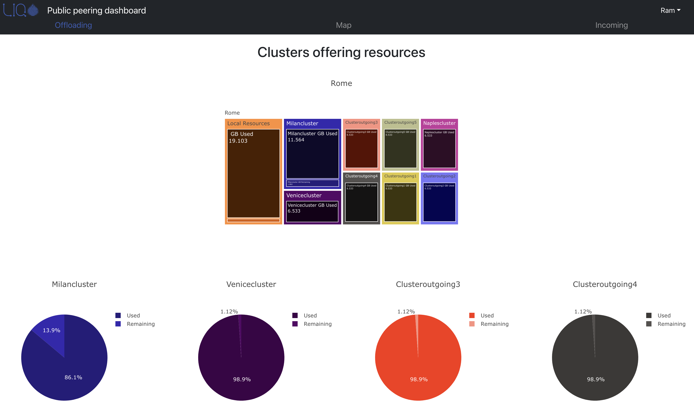
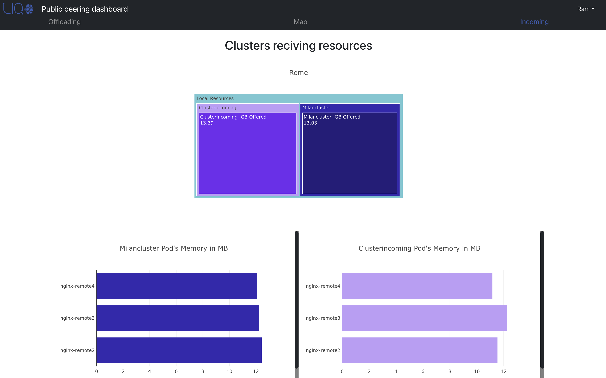
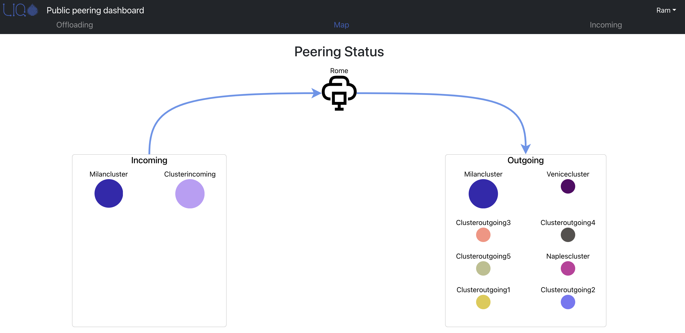

# Liqo Public Peering Dashboard

The *Liqo public peering dashboard* is an open-source, web-based dashboard that exposes the status of the Liqo peerings established with the current cluster (both incoming and outgoing), and the amount of resources (i.e., in terms of vCPUs and memory) used/offered in each peering by visually showing these metrics through charts designed to easily understand how much of the offered resources are in use.



## Prerequisites

* **Liqo**: since the dashboard shows data related to Liqo, this software must be running in your cluster. If you want to start using Liqo, you can check the [official documentation](https://docs.liqo.io/en/stable/) and the [quick start tutorial](https://docs.liqo.io/en/stable/examples/quick-start.html).
* **Helm**: this dashboard uses Helm for the installation process, hence you must have helm installed on your machine. You can find more about helm on the [official site](https://helm.sh/). You can also decide to avoid helm but in this case, you need to write down all the required YAML manifests.
* **Ingress controller**: this dashboard needs to be deployed in a cluster that has an ingress controller installed. To learn more about ingress controller you can read the [official Kubernetes documentation](https://kubernetes.io/docs/concepts/services-networking/ingress-controllers/).

## Environment Variables
The Dashboard's *frontend* uses REACT_APP_BACKEND_ADDRESS and REACT_APP_BACKEND_PORT environment variables set through [values](./chart/README.md) file to contact *backend* service.
Please be sure to modify backend *host* and *port* values accordingly.

## Deployment

The dashboard is divided into two components, a *frontend* and a *backend*, which are executed as separate pods. You can deploy them through helm, once you cloned the current repository:

```bash
helm install liqo-dashboard ./chart
```

The command above deploys a few resources into the cluster in the `liqo-dashboard` namespace.

When the dashboard is deployed on a production environment, you shall configure the appropriate ingress hostname, rather than using the default catch-all wildcard:

```bash
helm install liqo-dashboard --set host=<<host_here>> ./chart --namespace <<namespace_name>> --create-namespace
```

Additionally, if you want to use TLS encryption to enable HTTPS you should set tls.secretName as follows:

```bash
helm install liqo-dashboard --set host=<<host_here>> --tls.secretName=<<certificate_secret_here>> ./chart --namespace <<namespace_name>> --create-namespace
```

Note that the secret should already exist or cert-manager shall be present (and consequently the annotation must be declared for the ingress).

You can find the complete list of additional values [here](./chart/README.md).

## Screenshots 




## Contributing

All contributors are excitedly welcome. If you notice a bug you can open an issue to let us know or you can figure out how to fix it and open a pull request.


